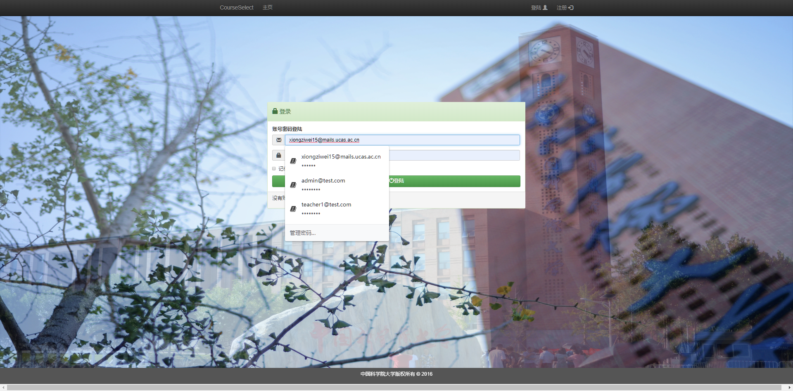

# CourseSelect 
原仓库使用了老旧的ruby2.2和rails4.2。这两个版本在现在的机器上部署很麻烦，因此我将原项目升级到了ruby2.6+rails6.0。同时这个仓库也是我自己的课程大作业，不便向原仓库提交pull request。

## 前置技能
### Bash
虽然我们在Windows环境下使用Rails，但是我们实际是在WSL内操作的。因此需要一定的Bash基础。

Bash是Linux环境下与用户交互地界面，我们输入命令然后回车，等待命令执行。例如在Bash内输入ls并回车，Bash将为我们打印出当前目录下所有的文件和目录。所有的Bash命令都是这样使用的。至于Bash的高级用法和指令间的数据交互涉及了更多Linux的知识，这里不列出，需要时请访问[鸟哥的网站](http://cn.linux.vbird.org/)，阅读基础篇内容，学习Linux。

通常每个命令都会接受一些参数，参数就跟在命令后。下面列举一些常用的Bash指令，让我们可以在WSL内完成日常操作

- `man [command name]`： man是Bash的手册，任何我们不懂的命令都可以通过man查询到相关信息。例如man ls，将会展示一个页面，该页面说明了ls命令的功能和用法。
- `ls [directory or file name]`：列出当前目录下所有文件
- `pwd`：打印当前工作目录。我们在Bash内操作时，操作都是针对某一个工作目录进行的，`pwd`会打印出我们当前所在的工作目录的名称。
- `cd [working directory to switch]`：切换工作目录。如`cd /home`将会把我们的工作目录切换为`/home`。目录命名规则请访问鸟哥的网站。
- `mkdir [dirctory name]`: 在当前工作目录下创建名为`directory name`的目录。
- `rm file/directory name`：删除文件或目录。
- `touch filename`: 在当前工作目录下创建一个名为filename的文件。
使用任何指令前，你都可以通过`man`去查看以下具体的使用规则和命令的功能。
#### 我能否不使用Bash
不可以，因为接下来修改，配置，运行Rails应用都需要使用到Bash。事实上Rails是一个社区驱动的开源框架，而Bash是开源世界里通用的交互系统，就像图形化界面至于Windows一样。没有了Bash我们就失去了与*nix系统交互的能力。

### git
`git`是Linus开发的一个版本控制工具，目的是为了维护软件版本变化的历史，允许我们在迭代的时候进行版本的回退和多人协同开发。使用git需要理解git的运行机制，限于篇幅，请访问[廖雪峰先生的博客](https://www.liaoxuefeng.com/wiki/896043488029600)学习git的知识。

### Ruby
Rails使用Ruby构建，因此掌握Ruby对熟悉Rails很重要。Ruby是一门简洁但是不简单的语言。这里建议阅读书籍`Well Grounded Rubist`（google即可找到免费的电子书），重点理解class，method，module，block四块内容。

### Rails
Rails的学习请访问[Rails Guide](https://guides.rubyonrails.org/getting_started.html)。或参考课程说明

## 使用
该仓库在WSL下运行，当然也可以到Linux下运行。由于Linux的配置比较简单，所以这里只附上Windows环境下的使用教程。
### 启用WSL
我们需要在Windows内启用WSL并安装Ubuntu18.04。我们只需要WSL1即可，不需要使用WSL2。请按照如下步骤启用WSL。
- 打开开始菜单，以管理员身份运行PowerShell
- 输入如下命令：`Enable-WindowsOptionalFeature -Online -FeatureName Microsoft-Windows-Subsystem-Linux`
- 重启电脑
- 前往Windows应用商店，搜索Ubuntu并安装18.04版本
### 安装Ruby2.6
前往https://rubyinstaller.org/downloads/，安装Ruby+Devkit 2.6以上版本
### 安装Postgresql
前往https://www.enterprisedb.com/downloads/postgres-postgresql-downloads，下载并安装postgresql11。安装过程中会要求设置用户名和密码。请记住自己设置的用户名和密码，后续我们查看数据库数据时需要用到。由于是示例，所以可以简单地设为user和password。

## 运行
到目前位置我们已经设置好了运行CourseSelect需要的环境了，接下来让我们试一试能不能使用。

首先在Windows内启动postgresql server。打开开始菜单，搜索pgAdmin，启动它。然后它会打开一个网页，我们登陆上去就可以了。不用管其它的事情。
在WSL内切换到自己喜欢的目录，按序执行如下指令
- `git clone https://github.com/Dicridon/CourseSelect`
- `cd CourseSelect`
- `bundle install`
- `rake db:migrate`
- `rake db:seed`
- `rails s`
保持当前命令行，不要中断它。打开浏览器，访问localhost:3000。你应该可以看到如下界面：

环境搭建成功了~

